# Mood Tracker & Mental Wellness Application

A web-based application developed as part of the Web Development course.

- **Student:** Shaymaa Mashaal  
- **Course:** Computer Science – Web Development  
- **Instructor:** Dr. Ghadir Khalil  
- **University:** LIU  
- **Date:** December 2025

## Project Description

**InnerGlow** is an interactive web application designed to help users monitor their mood, manage stress, and improve overall mental wellness. It provides a comprehensive set of features:

- **Mood Tracker:** Record daily moods, write notes, and track emotional patterns.  
- **Stress Detection:** Analyze sleep, heart rate, blood pressure, and lifestyle factors to estimate stress levels.  
- **Meditation & Mindfulness:** Access guided meditation videos and create custom timer sessions.  
- **Yoga Exercises:** Beginner-friendly routines to promote mental relaxation and physical flexibility.  
- **Diet:** Nutrition recommendations and brain-boosting food guidance.  
- **Find Therapist:** Locate therapists locally or globally via Google Maps.  
- **Book Appointments:** Schedule sessions with therapists or wellness services.  
- **Contact:** Communicate with support or administrators for inquiries or feedback.

The **frontend** is built with **React.js**, providing a dynamic and responsive interface.  
The **backend** uses **Node.js + Express.js** with a **MySQL database**, ensuring secure, persistent data storage and RESTful APIs for smooth frontend-backend communication.

---

## Setup Instructions

### Prerequisites

- Node.js (v14+)  
- npm  
- MySQL (via WAMP or another local server)  
- Git  

Technologies Used
Frontend: React.js, React Hooks, React Router, React-Bootstrap
Backend: Node.js, Express.js
Styling & UX: Custom CSS, glassmorphism effects, responsive design, animations

## **Backend Setup: Install dependencies and start the backend server**
```bash
cd server
npm install
npm start
```
## **Frontend Setup: Install dependencies and start the frontend development server**
```bash
cd client
npm install
npm start
```

Open your browser at http://localhost:3000
 to view the application.


## Screenshots of the UI

### Home Page
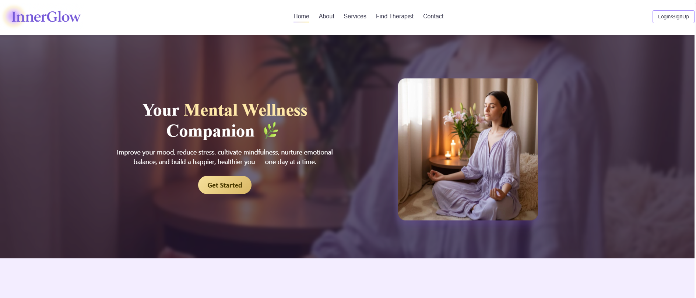
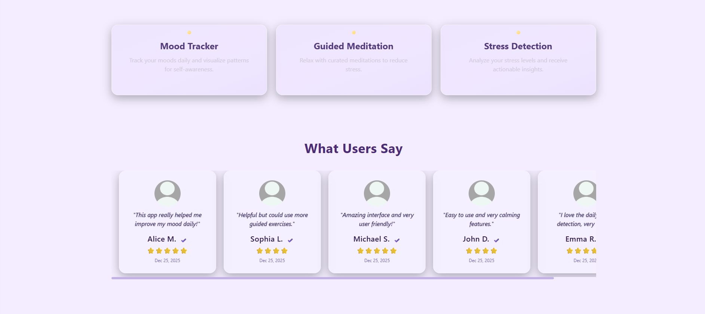
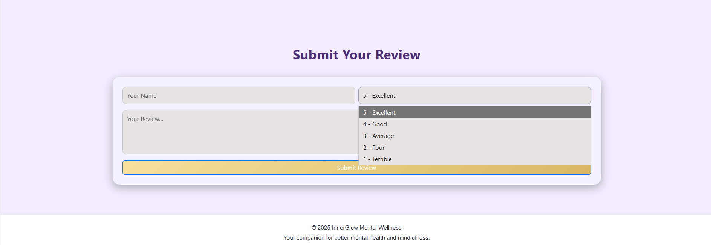

### About Page
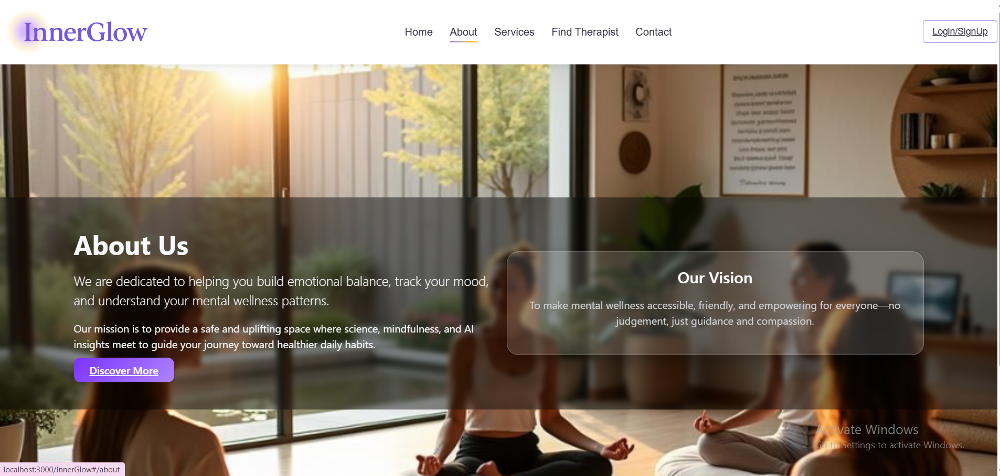

### Authentication Page
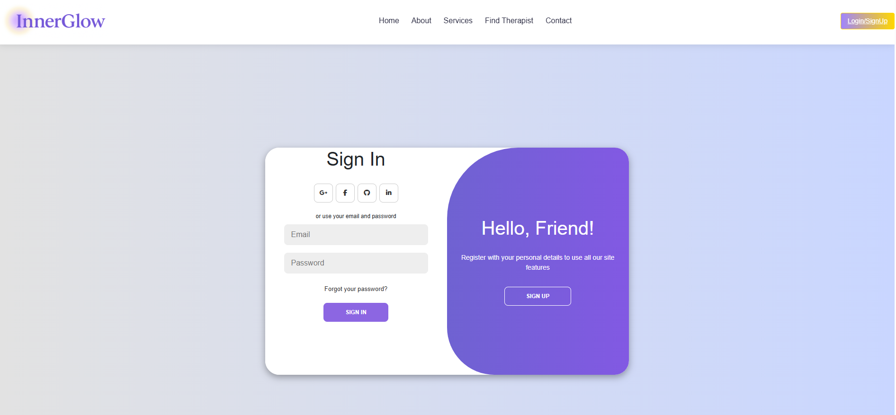

### Mood Tracker


### Stress Detection
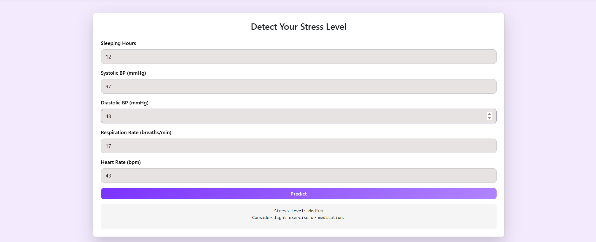
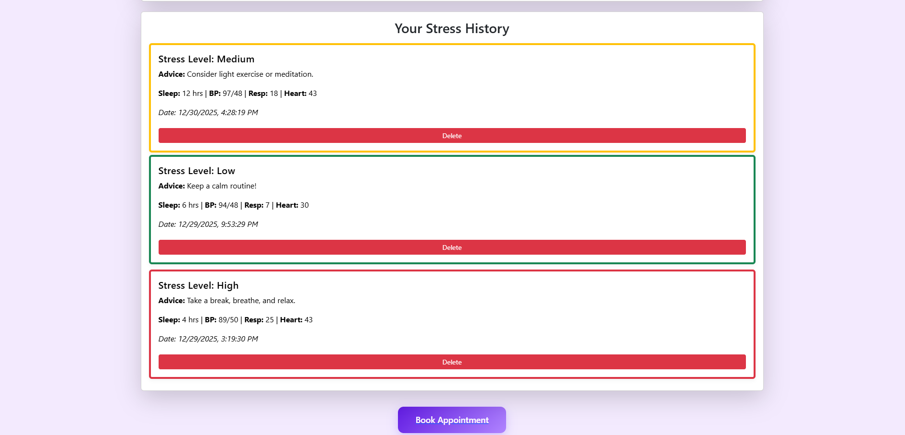 

### Meditation & Mindfulness
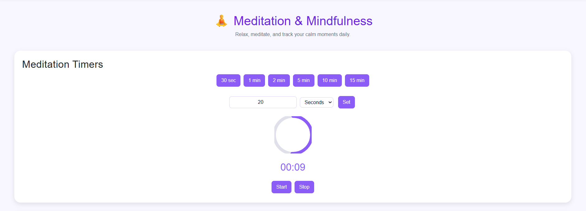
 
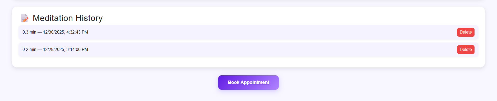

### Yoga Exercises

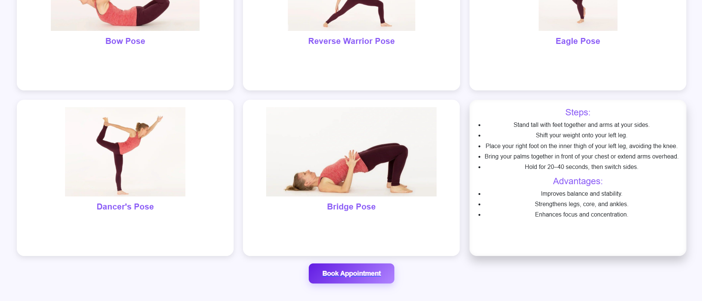

### Healthy Food

 

### Find Therapist
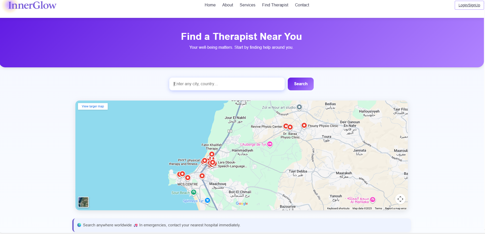

### Book Appointment
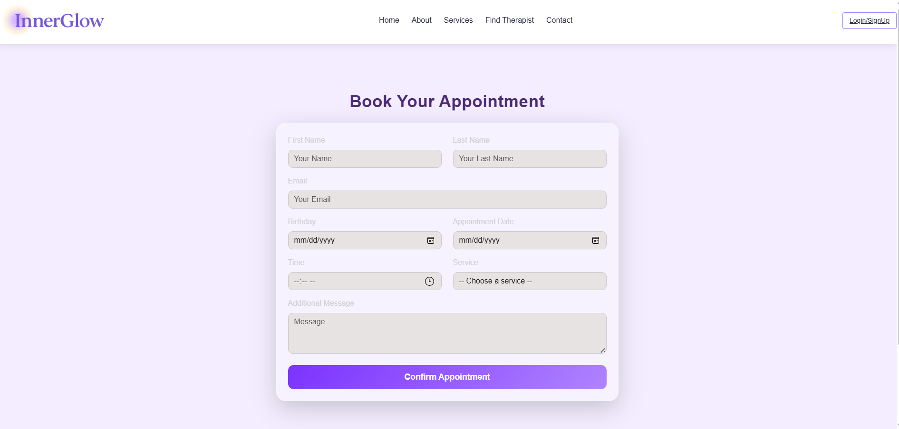

### Contact
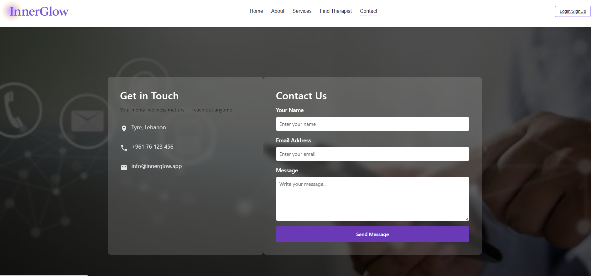


