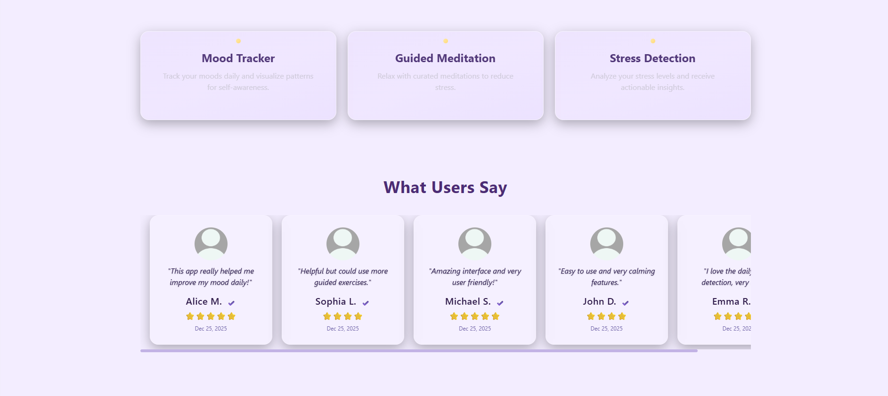
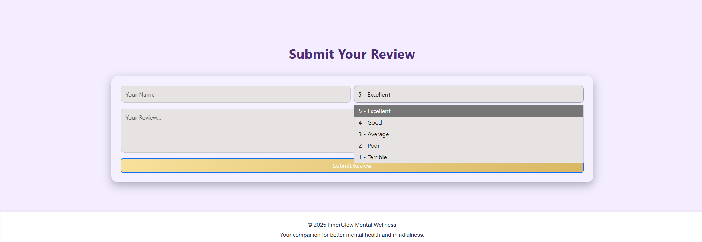
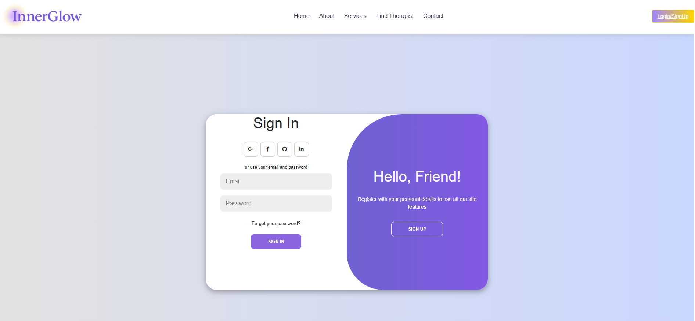
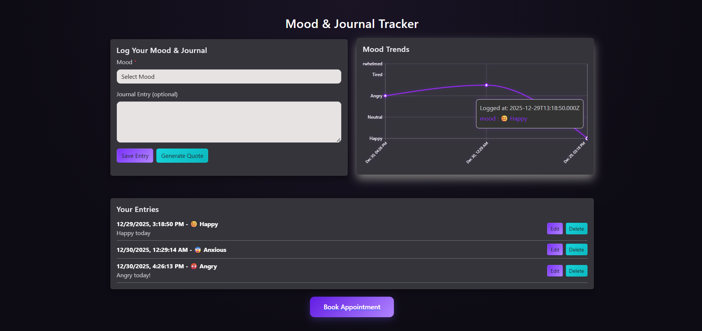
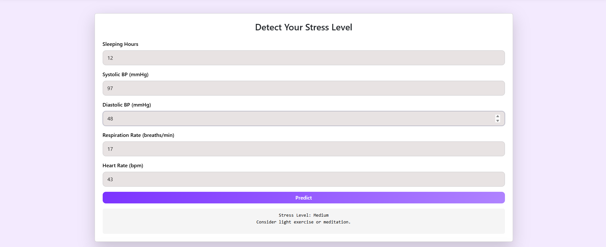
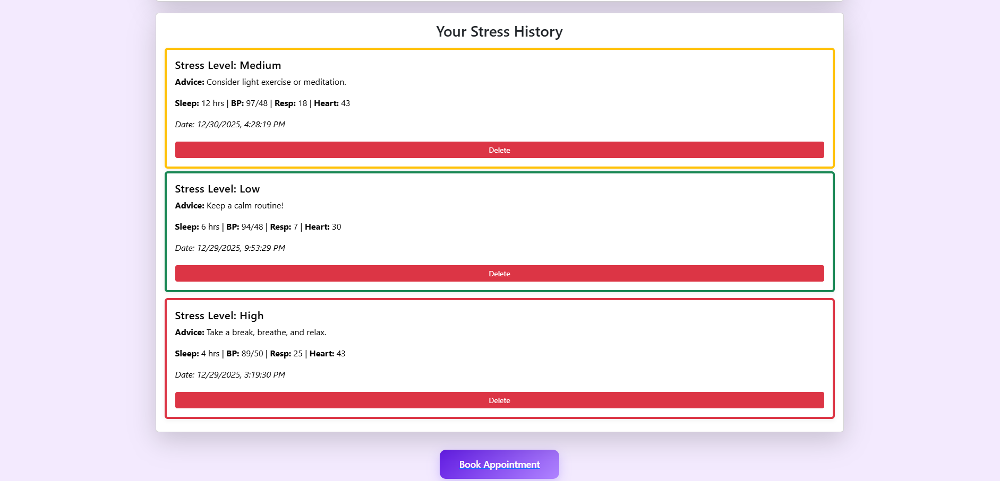
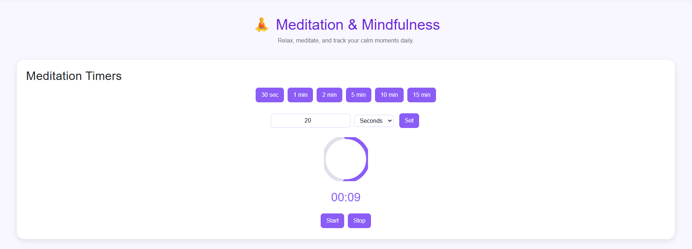
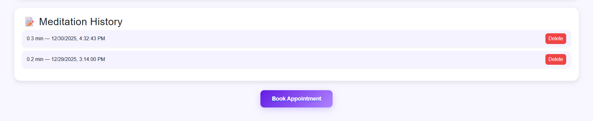
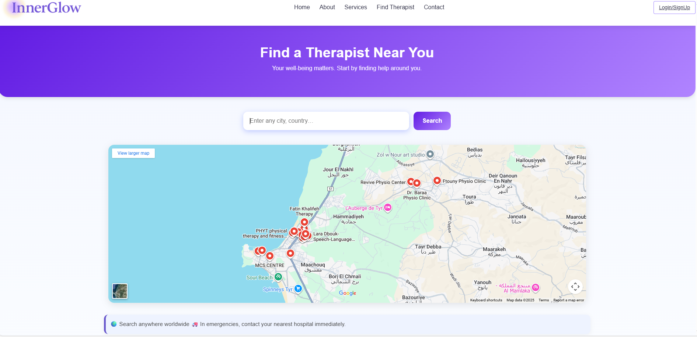
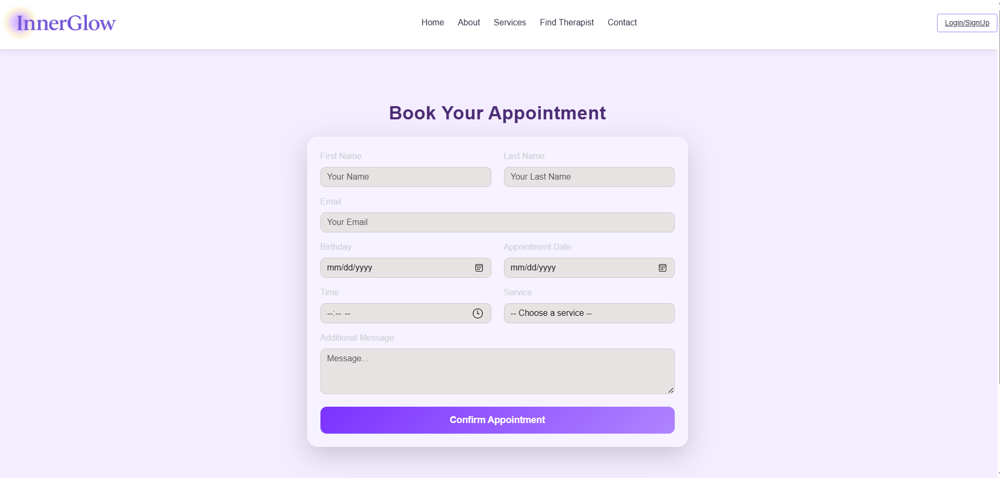

# InnerGlow – Mood Tracker & Mental Wellness Application

A **full‑stack web application** developed as part of the **Web Development** course.

---

## Project Information

* **Student:** **Shaymaa Mashaal**
* **Course:** Computer Science – Web Development
* **Instructor:** Dr. Ghadir Khalil
* **University:** LIU
* **Date:** December 2025

---

## Project Overview

**InnerGlow** is an interactive mental wellness platform designed to help users:

* Track emotional patterns
* Manage stress levels
* Practice mindfulness and relaxation
* Access wellness services

> ✅ The application focuses on **mental health awareness**, **user experience**, and **secure data handling**.

---

## Key Features

* **📝 Mood Tracker** – Log daily moods, add notes, and visualize emotional trends
* **📊 Stress Detection** – Analyze lifestyle inputs such as sleep and health indicators
* **🧘 Meditation & Mindfulness** – Guided videos and custom meditation timers
* **🧎 Yoga Exercises** – Beginner‑friendly yoga routines
* **🥗 Healthy Diet** – Brain‑boosting nutrition recommendations
* **🗺️ Find Therapist** – Search for therapists using Google Maps integration
* **📅 Book Appointments** – Schedule therapy or wellness sessions
* **📩 Contact** – Send inquiries or feedback to administrators

---

## System Architecture

* **Frontend:** React.js (SPA, responsive UI)
* **Backend:** Node.js + Express.js (RESTful APIs)
* **Database:** MySQL (Railway cloud database)
* **Deployment:**

  * Frontend → **Netlify**
  * Backend → **Render**
  * Database → **Railway**

---

## Technologies Used

### Frontend

* React.js
* React Hooks
* React Router
* React‑Bootstrap

### Backend

* Node.js
* Express.js

### Styling & UX

* Custom CSS
* Glassmorphism UI
* Responsive layout
* Animations

---

## Setup Instructions (Local Development)

### ✅ Prerequisites

* Node.js (v14+)
* npm
* MySQL (WAMP or any local server)
* Git

---

###  Backend Setup

```bash
cd server
npm install
npm start
```

> ℹ️ **Note:** The backend runs on `http://localhost:5000` by default.

---

###  Frontend Setup

```bash
cd client
npm install
npm start
```

Open your browser at:

```
http://localhost:3000
```

---

##  Environment Variables

⚠️ **Important:** Environment files are excluded from version control.

Example:

```env
REACT_APP_API_URL=https://innerglow-server.onrender.com
DB_HOST=your_db_host
DB_USER=your_db_user
DB_PASSWORD=your_db_password
DB_NAME=your_db_name
```

---

## 🌍 Live Deployment

* **Frontend (Netlify):**
  👉 [https://innergloww.netlify.app](https://innergloww.netlify.app)

* **Backend (Render):**
  👉 Deployed as a REST API

> ✅ The frontend communicates securely with the backend via environment variables.

---

## Screenshots

### 🏠 Home Page





### ℹ️ About Page


### 🔐 Authentication



### 📝 Mood Tracker



### 📊 Stress Detection




### 🧘 Meditation & Mindfulness





### 🧎 Yoga Exercises


### 🥗 Healthy Diet


### 🗺️ Find Therapist



### 📅 Book Appointment



### 📩 Contact Page


---

## 🎓 Academic Note

This project was developed for **educational purposes** and demonstrates:

* Full‑stack development principles
* RESTful API integration
* Cloud deployment
* Secure configuration using environment variables

---

## ❤️ Acknowledgment

Special thanks to **Dr. Ghadir Khalil** for guidance and support throughout the course.

